# THZ1/THZ2 object type `$18` (goal sign) and the act-clear chain

Research only. ROM: Sonic Chaos (Europe) v1.2, SHA-256
`eabc8db59746714262d2f91a921d054823484349099a9fcd04fd6e84a1fee607` (verified; never committed).
`SonicChaos_POC` was not touched.
Machine-readable facts: `data/rom-cache/object-18-act-clear.json` (numeric labels only).
Tool: `tools/object_18.py`. Tests: `tests/test_object_18.py` (45 tests; `tests/verify_cache.py` also regenerates the cache).
Builds on `docs/object-50.md` (THZ3 boss), `docs/mapped-object-screen-registration.md` and `docs/thz1-object-graphics.md`.

Evidence classes (same vocabulary as the earlier studies):
**DECODED DATA**, **BYTE-VERIFIED ASSEMBLY** (routine bytes hashed per region and disassembled by hand),
**SOURCE-TRACED BEHAVIOR** (read from the disassembly), **CONTROLLED ROUTINE RESULT** (the original Z80 routines executed on
`z80` with explicit RAM, `tools/oracle.py`), **EMULATED ORIGINAL FRAME** (the whole original game booted in
`tools/sms_frame_harness.py` and forced into THZ1/THZ2/THZ3 — original code driving an approximate VDP), **UNRESOLVED**.

Numbers written `$xx` are hexadecimal. "Update" = one original object-scheduler pass = one game frame. `dx = playerX - signX`,
`dy = playerY - signY`, both integer world coordinates of the object anchor `(+$11, +$14)` and the player anchor `($D511, $D514)`.

## 1. Answer

The original `$18` does **its own** contact test (it does not use a separate trigger system), and it does **not** end the act by
itself: contact only stops the level timer and starts a hop; the act ends through a child object (`$19`) that asks for player
state `$20`, whose handler sets the act-complete flag in `$D293`.

| Question | Result | Evidence |
|---|---|---|
| Contact rule | State-3 callback `$A88E` → shared overlap helper `$6328`. Player anchor inside a box around the sign anchor: `|dx| <= playerExtX + 12`, `-42 <= dy <= playerExtY`, all **inclusive**, both directions. Sonic's extents are `(8,24)` in every observed state (`(9,24)` in state `$0F`), so the box is `dx -20..+20`, `dy -42..+24` → THZ1 world X 3940..3980, Y 516..582; THZ2 X 3940..3980, Y 612..678. **Gate**: the test only runs while the player's X speed `$D516/17` is non-zero **or** the player's requested state `$D502` is `$18`. No other player state, flag, direction or Y speed matters. | BYTE-VERIFIED + CONTROLLED (32,805 grid cells, 0 mismatches) + EMULATED |
| What `$18` triggers | On contact: `$D2BE := 0` (level timer stops), `$D445 := 0`, sign Y velocity high byte `+$19 := $FC`, then state 4 (first touch) or state 6 (retouch); first touch also sets the camera pan target `(signX-$80, signY-$99)`. It writes **nothing** to the player. After a 130-update hop it lands, rolls a ring-count prize, and spawns type `$19`, which ends in player state `$20`. | SOURCE-TRACED + CONTROLLED + EMULATED |
| Player state `$20` | Requested by `$19` state 4 (`CALL $03F5` → `$4892`: `$D502 := $20`, sound `$89`, or `$97` when `$D298 = 2`) **once the player is on the floor** (`$D522` bit 1). The `$20` script's handler `$83A6` (bank `$0C`) makes the player run right (+`$10`/update up to `$0600`, input ignored) and, when `playerX - cameraX > $120`, stops it and sets `$D293` bit 5 (act index `$D298` < 2, THZ1/THZ2) or bit 4 (act index 2, THZ3). | BYTE-VERIFIED + CONTROLLED + EMULATED |
| Timer stop | At the contact update (`$A8A7..$A8AB`: `XOR A; LD ($D2BE),A`). The tick routine `$27EE` (frame interrupt) does nothing while `$D2BE = 0`. The tally (`$2D08`) does not read the time again; the bonus value is computed from `$D2BF` by the child (`$041F`). | BYTE-VERIFIED + CONTROLLED + EMULATED (time frozen from contact) |
| Sign state/animation change | State 3 → 4 is caused **directly by the contact update** of `$A88E` (`LD (IX+2),4`). State 4 → 5 is caused by the sign's own hop reaching its saved Y (internal, 130 updates). State 3 → 6 is the retouch path. Nothing external or global (act-clear flag, timer) changes the sign. | SOURCE-TRACED + CONTROLLED |
| THZ1 vs THZ2 | Identical. Same type, flags/parameter/aux all `$00`, same X (3960), same code/tables; only Y differs (558 vs 654). Emulated timelines match to ±1 harness frame. The ring-count prize table is selected by **zone** parity (`$D297`), not act, so both use the same table. | DECODED + CONTROLLED + EMULATED |
| `$50` convergence | Partial. `$50` state 5 calls the **same** vector `$03F5` → `$4892` (at `$81DF`), so player state `$20`, handler `$83A6` and the `$D293` flag are shared (bit 4 for THZ3, `$1543` sequence). `$50` has no sign, no `$19` child, no timer stop (timer keeps running, emulated with a forced state `$20`). | BYTE-VERIFIED + EMULATED |
| Results | After the flag the main loop (`$1333`) branches at once to `$14AE`: 198 fixed waits, then the results screen `$32F9`; ring/bonus tally `$2D08` starts 275 frames after the flag (emulated). Progression (`$D298 += 1`, reload) is written at `$1534..$153B` at the end of that sequence, not at contact. | BYTE-VERIFIED + EMULATED |

## 2. Placement and act differences

**DECODED DATA + BYTE-VERIFIED ASSEMBLY (creator `$700EB`).**

| Act | Record | ROM offset / bank:CPU | Raw bytes | Stored X,Y | World anchor | Flags / parameter / aux0 / aux1 |
|---|---:|---|---|---|---|---|
| THZ1 | 53 of 53 | `0x70782` / `1C:$8782` | `18 78 10 2E 03 00 00 00 00` | 4216, 814 | **(3960, 558)** | `$00/$00/$00/$00` |
| THZ2 | 41 of 41 | `0x708F4` / `1C:$88F4` | `18 78 10 8E 03 00 00 00 00` | 4216, 910 | **(3960, 654)** | `$00/$00/$00/$00` |
| THZ3 | none | | | | | `$18` is not placed in THZ3 |

The two records differ only in Y (+96). Nothing in `$18` reads flags, parameter, aux0 or aux1 (they are zero), so there is no
parameterised behaviour to document. Creation (controlled run of `$80EB`): type `$18`, state 0, `+$04 = $40`, token `+$3E = index + 1`
(53 / 41), occupancy byte `$D400 + index = $18`.

Canonical placement coordinates were not altered.

## 3. Dispatch

**BYTE-VERIFIED ASSEMBLY + DECODED DATA.** No per-type jump table; dispatch is data-driven (same scheme as `docs/object-50.md`):

```
placement creator $80EB (bank $1C)            -> slot +$00 = $18, state 0
scheduler $5DF1: type < $26 -> bank $0C paged
  CALL $64FA   animation engine (script interpreter, frame record -> +$2C/+$2D extents)
  CALL $5E91   JP (IX+$0C/$0D)   <- per-state callback
  JP   $61E1   visibility / removal
type table   ROM $065BA + (type-1)*2 ; entry for $18 at ROM $065E8 = $A7BC (bank $0C, ROM $327BC), 7 states
mapping      ROM $3C000 + type*2 = $3C030 -> $8EAE (bank $0F, ROM $3CEAE), frames 0..5
type $19     entry ROM $065EA = $AA4F (bank $0C), 5 states; mapping $3C032 -> frame 0/1
```

| State | Script (CPU / ROM) | Callback(s) | Frames |
|---:|---|---|---|
| 0 | `$A7CA` / `0x327CA` | `$A867` | 0 |
| 1 | `$A7D3` / `0x327D3` | `$A873` | 0 |
| 2 | `$A7D9` / `0x327D9` | `$A87D` | 0 |
| 3 | `$A7E2` / `0x327E2` | `$A88E` (duration `$E0`, restarts forever) | 1 |
| 4 | `$A7E8` / `0x327E8` | `$A8C8` (first record), `$A8CE` | 1..5 |
| 5 | `$A81F` / `0x3281F` | `$032F` (idle RET); script calls `$AA47` once | 1 |
| 6 | `$A82E` / `0x3282E` | `$032F`, then `$A8FA` | 1..5 |

Type `$19`: states 0..4 at `$AA59 / $AA5F / $AA65 / $AA78 / $AA81`, callbacks `$AA87 / $AAE4 / $AB0A / $AB48 / $AB8C`.
Every region has its ROM offset, length, first 16 bytes and SHA-256 in the JSON (`routines`, 45 entries).
Type `$1A` (table at `$AB9F`, handlers at `$ABDF..$AC4A`) sits next to `$19` but nothing in THZ1/THZ2 spawns it (**UNRESOLVED**, not needed).

## 4. Object fields (type `$18`)

**SOURCE-TRACED BEHAVIOR.**

| Field | Use |
|---|---|
| `+$01` / `+$02` | current / requested state (writing `+$02` changes state at the next update) |
| `+$03` | bit 7 set in state 0: the overlap helper ignores the player's `$D503` bit-6 gate |
| `+$04` | bit 6 = off-screen (set by `$61E1`); bit 1 (keep-alive) is **never** set, so the sign is removed by the shared cleanup when it leaves the window |
| `+$11/+$12`, `+$14/+$15` | world X, Y (anchor). Y is moved by the hop and restored to the saved value |
| `+$18/+$19` | Y velocity 8.8 (hop) |
| `+$21` | contact bits from the overlap helper (only "non-zero" is used) |
| `+$2C/+$2D` | contact extents copied by the animation engine from the frame record: frame 1 = **(12, 42)**, frames 2..4 = (8, 48), frame 5 = (13, 42), frame 0 = (0, 0) |
| `+$34` | prize class (0 = retry, 1..3 rewards, `$FF` none; 4..8 after a retry) |
| `+$35` | retry flag: 0 first pass, `$FF` after a class-0 result |
| `+$3C/+$3D` | saved Y (landing target); `+$3E` placement token |

## 5. State machine

```mermaid
stateDiagram-v2
    [*] --> S0
    S0 --> S1: next update
    S1 --> S2: object on-screen (+$04 bit 6 clear)
    S2 --> S3: next update
    S3 --> S4: contact, +$35 = 0
    S3 --> S6: contact, +$35 != 0
    S4 --> S5: hop lands (130 updates), prize class != 0 and != retry
    S4 --> S3: class 0 (retry), +$35 = $FF, art selector $20
    S6 --> S5: 64 updates of spin, random class
    S5 --> [*]: idle; type $19 child continues the chain
```



| State | What happens | Evidence |
|---:|---|---|
| 0 | `$A867`: `SET 7,(IX+3)`; `+$34 = +$35 = 0`; script requests state 1 | BYTE-VERIFIED |
| 1 | `$A873`: if `+$04` bit 6 set return; else request state 2 | BYTE-VERIFIED |
| 2 | `$A87D`: `$D3B3 := $12` (sign art load selector; census: tiles `$6A-$A9`); if the player's requested state is `$12` it is changed to `$0E`; script requests state 3 | BYTE-VERIFIED + CONTROLLED |
| 3 | `$A88E` (frame 1, extents 12×42): the contact test of section 6, every update | CONTROLLED + EMULATED |
| 4 | Script: sound `$F8` once, then a spin loop of 8 records × 2 updates (frames 1,2,3,4,5,4,3,2) with sound `$AA` every 4 updates. `$A8C8` sets `$D4A3 := $FF` (purpose UNRESOLVED). `$A8CE` (from the 3rd update): Y speed `+= $10` (clamp `$0600`), move, and when Y reaches the saved Y restore it and run `$A8FA` | CONTROLLED + EMULATED |
| 5 | Script: `FF 01 $AA47` spawns `$19` (vector `$032C`, pool `$D540`), sound `$AB`, frame 1 held forever | CONTROLLED + EMULATED |
| 6 | Script: 4 loops of the spin (8 records × 2 updates, sound `$AA` each 4), then `$A8FA` again | CONTROLLED |

## 6. Exact contact test

**SOURCE-TRACED + CONTROLLED (original `$A88E` run on the Z80 core over a 5×81×81-cell grid, 0 mismatches against the formula below).**

```text
; state 3 callback $A88E, every update
if player.requestedState != $18 and player.xSpeed($D516:$D517) == 0: return      ; $A88E..$A89A   (no other gate)
camera.leftLimit($D280) = max(camera.leftLimit, camera.x($D174))                 ; $A89B CALL $A8C4 -> $0353
overlap($6328):                                                                   ; $A89E CALL $033B
    ; +$03 bit 7 is set, so the player's $D503 bit-6 gate is skipped; +$03 bit 6 is clear
    dx = player.x - sign.x                                                        ; 16-bit
    if dx >= 0:  need dx <= 255           and dx <= (playerExtX + 12) & $FF       ; inclusive
    else:        need dx >= -255 (not -256) and -dx <= (playerExtX + 12) & $FF    ; inclusive
    dy = player.y - sign.y
    if dy >= 0:  need dy <= 255           and dy <= playerExtY                    ; only the PLAYER extent below the anchor
    else:        need dy >= -255 (not -256) and -dy <= 42                         ; only the SIGN extent above the anchor
    (minimum-penetration axis selection only decides which contact bits survive; some bit always survives)
contact = (sign.$21 & $0F) != 0                                                   ; $A8A1..$A8A6
```

* `playerExtX/Y` are `$D52C/$D52D`, copied from the player's **current frame record** by the same animation engine. Emulated play over
  12,000 frames of random input (stand, walk, run, jump, roll, spring, hurt…) recorded `(8,24)` in every state except `(9,24)` in state `$0F`
  (and a transient `(0,0)` in state 0). Earlier research fixtures that used `(9,18)` were test assumptions, not measured values.
* `sign.x/sign.y` are the placement anchor; `12` and `42` are the frame-1 record bytes (`+$2C`, `+$2D`). Frame 1 is loaded for the whole
  of state 3 (verified at state entry).
* The box is asymmetric: X is symmetric, but the vertical range is `[-42, +playerExtY]` around the sign anchor.

| Player extents | dx range | dy range | Evidence |
|---|---|---|---|
| (8,24) Sonic | -20..+20 | -42..+24 | CONTROLLED, full grid |
| (9,24) | -21..+21 | -42..+24 | CONTROLLED, full grid |
| (8,18) / (9,18) / (0,0) | -20..20 / -21..21 / -12..12 | -42..+18 / -42..+18 / -42..0 | CONTROLLED, full grid |

| Case | Result |
|---|---|
| `dx = 20 / 21`, `dy = 0` | contact / none |
| `dx = -20 / -21` | contact / none |
| `dy = +24 / +25`, `dx = 0` | contact / none |
| `dy = -42 / -43`, `dx = 0` | contact / none |
| `|dx|` or `|dy|` ≥ 255 | none (16-bit range check) |

Gate and irrelevant inputs (all CONTROLLED at `dx = dy = 0`):

| Case | Triggers |
|---|---|
| X speed `+$0400`, `$FC00` (negative), `$0001` | yes |
| standing still, requested state `$02` or `$12` | **no** |
| standing still, requested state `$18` | yes |
| moving with `$D503` bit 1 (ball), bit 0 (air) or bit 6 | yes (flags are not tested) |
| Y speed `$0800` | yes (not tested) |

So both directions trigger, rolling/jumping do not matter, and a player who stops inside the box does not trigger until they move
again (or unless requested state `$18`, which is set by the reward setter at `$4770`; its semantic name is **UNRESOLVED**).
The left camera lock `$0353` also runs only while the gate passes.

Consequence of the world box for the two acts (Sonic): X 3940..3980 in both; Y 516..582 (THZ1), 612..678 (THZ2).
Standing on the ground next to the sign the player's anchor Y equals the sign anchor Y (emulated: 558 and 654), i.e. `dy = 0`.

### Comparison with the POC adapter (facts only)

The POC adapter reproduced the old THZ1 rule `x >= signX + 10`, `y > signY - 108` (the two values 3970 / 450). The ROM rule differs:
the ROM box spans X `signX-20..signX+20` (two-sided), not `x >= signX + 10` (one-sided, only the right half plus everything beyond);
the ROM vertical window is 66 px tall (`signY-42..signY+24`), not open-ended below `signY-108`; and the ROM requires the movement gate.
The adapter geometry is therefore not ROM behaviour. The ROM-derived rule above is the canonical one.

### Sign visibility gate (state 1)

The sign only reaches state 3 after it has been on-screen once (`+$04` bit 6 clear, set/cleared by `$61E1` from the shared window and the
spawn map at `1C:$8146`; cells 0/1 = on-screen, 2/3 = off). Horizontal window `(x - camX + 128)/2 < 256`, vertical `(y - camY + 128)/2 < 256`, then the
map cell. See `docs/object-50.md` section 2 for the shared spawn-map rule. The sign is removed by `$61E1` when it leaves the window (CONTROLLED: `$FE`
in any state, including state 5) and recreated from its placement in state 0. The contact box lies within a few tens of pixels of the sign, so it is
on-screen whenever the contact box is reachable in the original.

## 7. What contact does

**CONTROLLED (original `$A88E`, first touch and retouch).** In the contact update (`$A8A7..$A8C3`):

| Write | First touch (`+$35 = 0`) | Retouch (`+$35 != 0`) |
|---|---|---|
| `$D2BE` (level timer run flag) | `0` | `0` |
| `$D445` | `0` | `0` |
| sign `+$19` (Y velocity high byte) | `$FC` (velocity `$FC00`, -4 px/update; `+$18` is 0 from creation) | `$FC` |
| sign `+$02` | 4 | 6 |
| camera pan (`$AA22`, vector `$0359`): `$D15E` bit 7, `$D15F` bit 0, `$D2DA/$D2DC` | set; target `(signX-$80, signY-$99)` = (3832, 405) in THZ1 | not repeated |
| player fields | **none** (requested state, speed, position unchanged) | none |

The player is **not** locked at contact. In the emulated game the player keeps full control until player state `$20` starts (hostile input
after state `$20` is ignored: the flag frame is unchanged). The left scroll limit `$D280` is raised to the camera X on each gated update of state 3.
`$D445` is a counter used by a zone-4 routine (`$4B46`) and a bank-`$1E` object; in THZ it is only cleared (role **UNRESOLVED**).
The contact update also re-arms nothing else: there is no score award, no sound (the first sound is `$F8` one update later).

## 8. Hop, prize and the `$19` child

### Hop and landing (CONTROLLED; THZ1 and THZ2 identical)

Updates counted from the contact update (contact = update 0; "+n" = n updates later):

| Update | Event |
|---:|---|
| +0 | state 3 requests 4, timer stops, `+$19 := $FC` |
| +1 | state 4 script starts: sound `$F8`, frame 1, callback `$A8C8` |
| +3, +7 … +127 | sound `$AA` (32 times, every 4 updates) |
| +3 | first `$A8CE` update: Y speed `$FC00`, then `+= $10` per update; Y first changes here (558 → 554) |
| ≈ +60 | apex, 126 px above the anchor (`558 → 432`; `654 → 528`), then falls |
| +130 | Y reaches the saved Y: restored, `$A8FA` runs (prize, state 5) |
| +131 | state 5, sound `$AB`, script calls `$AA47`; type `$19` exists |

Model: `vy = $FC00` → `vy += $10` per update (clamp `$0600`), `y += vy`; land when `y >= savedY`. The hop is independent of the player.

### Ring-count prize (CONTROLLED, all 100 BCD ring counts)

`$A8FA` (first landing) looks up the BCD ring count `$D29A` in a 64-byte table (CPIR) selected by **zone** parity
(`($D297 + 1)` odd → table `$A919`, used by all THZ acts; else table `$A962`), class = `3 - (first match index / 16)`, `$FF` if absent:

| Class | THZ ring counts (BCD) | Effect | Art selector `$D3B3` (Sonic / other) |
|---:|---|---|---|
| 3 | 15 30 40 60 | `$D2C3 += 1` (lives; bit 7 is the game-over flag) | `$1D` / `$1B` |
| 2 | 09 19 29 39 49 59 69 79 89 | `$D29A += $10` (BCD, carry dropped) | `$1E` |
| 1 | 55 65 77 88 95 97 99 | vector `$03F2` → `$3104`: sound `$A9`, `$D299 += 1` (max `$99`; identity **UNRESOLVED**) | `$1B` / `$1D` |
| 0 | 16 28 32 44 58 | retry: `+$35 = $FF`, `$D3B3 = $20`, back to **state 3** | `$20` |
| `$FF` | the other 71 counts | none | `$1F` |

After a retry, the next touch goes to state 6 (64 spin updates) and `$A8FA` rolls `+$34 = ($D12F & 7) + 1` (frame counter): 1 → `$D299`,
2 → rings +10, 3 → extra life, 4..8 → nothing (`$1F`). Class 2..3 effects and the art selector number are the only recovered semantics; the
graphics behind `$1B..$20` were not decoded (**UNRESOLVED**). The prize is decided on the ring count at landing, before the bonus value of the child.

### Type `$19` child (CONTROLLED + EMULATED)

| Child update (+131 = its update 0) | Event |
|---:|---|
| 1 | state 0 (`$AA87`): copies two RAM blocks (`$AAC0`, `$AAD0`), X = `cameraX + $104`, Y = `cameraY($D176) + $50`, bit 7, state 1 |
| 2..18 | state 1: X -= 8 per update until `X <= cameraX + $85` (3964 with camera 3832) |
| 19..146 | state 2: 32 loops of 4 updates, sound `$BC` each loop, digits cycle |
| 147 | state 3: vector `$041F` (`$6276`) gives HL from time `$D2BF` and rings `$D29A`; `$D2A6 := HL`; equal digits call `$03F2`; a zero result is first replaced by `$0777` |
| 148 → | state 4 (`$AB8C`): every update, unless player state is `$20`: `$037D`, then if `$D522` bit 1 (floor): `CALL $03F5` |

`$041F`: H = time-bonus entry (BCD time `$D2BF` < `$0029` → 9, `< $0059` → 8, … `< $0459` → 1, else 0; table `$62AD`), L = `(rings - $11)` in BCD
(no borrow into H; 0 rings gives `$0989`). A zero HL becomes `$0777`, whose three equal digits call `$03F2` (controlled: time ≥ 4:59 with 11 BCD rings → `$0777`,
`$D299 += 1`). Controlled samples in the JSON. The child waits for the floor with no timeout (controlled: floor bit withheld
for 250 updates → request only when supplied).

Earliest player-state-`$20` request: +131 (child exists) + 148 = **+279** after contact (emulated: request/sound `$89` at frame 346 with contact at 67);
the player's state is `$20` from the next frame, **+280**.

## 9. Act-clear call chain

**BYTE-VERIFIED + EMULATED (THZ1, THZ2; frames counted from the contact frame = 0).**

| Step | Routine | When | Writes |
|---|---|---|---|
| 1 contact | `$A88E` → `$A8A7` | 0 | `$D2BE := 0` (timer stops), sign state 4 |
| 2 hop + landing | `$A8CE`, `$A8FA` | 0..130 | prize, `$D3B3`, sign state 5 |
| 3 child | `$AA47` → `$19` | +131..+279 | `$D2A6` (bonus) at child update 147 (+278) |
| 4 player state | `$AB8C` → `$03F5` → `$4892` | +279 (needs floor; no timeout) | `$D502 := $20`; sound `$89` (`$97` if `$D298 = 2`) |
| 5 player runs | state `$20` script `FF 05 $8EE1,$83A6` → `$83A6` | from +280 | X speed +`$10`/update to `$0600`; movement via `$0338`; input ignored |
| 6 flag | `SET 5` at `$83E7` or `SET 4` at `$83ED` | when `playerX - cameraX > $120` (+309 in the emulated THZ1 run; depends on where the player stands) | `$D293 |= $20` if `$D298 < 2` else `$10`; X speed 0 |
| 7 main loop | `$1333` (RLCA chain on `$D293`: bit 7 `$1365`, bit 6 clear `$138A`, **bit 5 `$14AE`**, bit 4 `$1543`, bit 2 `$15F2`, bit 1 `$1673`, bit 0 `$1696`; otherwise `$16B8` frame update) | next loop iteration (+1 frame) | |
| 8 act clear | `$14AE` | 60 waits; `$1CEB`; 96; `$18E1`; 30; sound 0; `$297E`, `$4FCE`, `$21DA`, `$342A`; 12 → **198 frames** | objects are frozen (the level frame `$16B8` is no longer called) |
| 9 results screen | `$32F9` (draws; lives/emerald icons; 60-frame wait) then `$2D55` (returns unless `$D298 = 2`), `$2D08` | `$32F9` at flag + 199, `$2D08` at flag + 275 (emulated) | see below |
| 10 progression | `$152F..$153E` | flag + 835 (emulated) | `RES 5,$D293`; `$D298 += 1`; `SET 1,$D293` (level load) |

**Does it stop gameplay?** Gameplay (player/object update) stops at step 7: the main loop leaves the `$16B8` branch when `$D293` bit 5/4 is set.
No other flag is written for control or time.

**Timer and results.** The timer stopped at step 1, 309+ frames before the sequence. The results tally (`$2D08`) counts `$D29A` (rings) down
one BCD step per iteration awarding BCD `10` per ring (`$27E5`), then counts the `$D2A6` bonus down by 1 per step awarding BCD `1` (`$27E2`), sound `$B4`;
pressing a button (`$D137` non-zero) skips the pacing delay `$2EE6`. The display scale of the score bytes is **UNRESOLVED**.
Ring/time results therefore begin 275 frames after the act-complete flag (199 to the results-screen routine, 76 more inside it); the bonus value itself was
fixed about 31 frames before the flag (one update before player state `$20` is requested).

**Where progression is written.** Completion state is not written at contact, at state `$20` request or at the flag: only `$D293` bit 5/4
(a request) is. `$D298` (next act) changes at `$1534..$1538` after the results sequence. This matches the THZ3 observation in `docs/object-50.md`
(next zone (1,0) ≈1041 frames after the boss conversion).

## 10. Player state `$20`

**BYTE-VERIFIED + CONTROLLED.** Script `$839E`: `FF 05 $8EE1 $83A6` (one-shot call of the run-animation frame selector `$8EE1`, then callback `$83A6`).
Handler `$83A6` each update:

```text
clear +$04 bit 7 and bit 4 (no mirror); Y speed := 0
d = playerX - cameraX                                   ; 16-bit
if d <= $F8: run                                        ; $83C2..$83C9
else:
    RES 7,$D15E ; $D280 := cameraX                      ; vector $0407 (camera release / left limit)
    if d <= $120: run
    else: xSpeed = 0 ; $D293 |= ($D298 < 2 ? $20 : $10) ; return        ; no movement this update
run:
    if xSpeed < 0: xSpeed = 0
    if xSpeed.high < 6: xSpeed += $10
    position += xSpeed                                  ; vector $0338
```

Controlled results: flag set exactly when `d >= $121` (`d = $120` does not);
`$D293` becomes `$60` for `$D298` 0/1 and `$50` for `$D298` 2; speed sequence 16, 32, 48 … capped at `$0600`; a negative speed restarts from 0 (→ 16).
A negative `d` (player left of the camera) would compare as a huge 16-bit value and set the flag at once (not reachable in the chain).
Because the handler sets velocity itself and never reads input, control is lost as soon as state `$20` runs (emulated: holding LEFT/DOWN/jump
after state `$20` leaves the flag frame unchanged).

## 11. Relation to THZ3 type `$50`

**BYTE-VERIFIED + EMULATED.**

| | `$18` (THZ1/2) | `$50` (THZ3) |
|---|---|---|
| Who requests player state `$20` | type `$19` state 4 (`$AB9B`) | `$50` state 5 callback (`$81DF`) |
| Routine | `$03F5` → `$4892` | `$03F5` → `$4892` (same bytes) |
| Floor contact required | yes (`$D522` bit 1) | yes (same bit, `docs/object-50.md`) |
| Sound | `$89` | `$97` (act index 2) |
| Handler / flag | `$83A6`, `$D293` bit 5 (idx < 2) | `$83A6`, bit 4 (idx 2) |
| Main-loop branch | `$14AE` | `$1543` (emulated: same frame as the flag) |
| Timer | stopped at contact | **not touched**: with a forced `$D502 = $20` in THZ3 `$D2BE` stays `$FF` and the time advances through the flag |
| Bonus (`$D2A6`) | computed by `$19` | no `$19` child; how `$D2A6` is set in THZ3 is **UNRESOLVED** (not followed) |

So the two paths converge on the same player-state `$20` tail (`$4892` → `$83A6` → `$D293` flag); they do not share the sign/child stage or
the timer stop. The `$1543` (zone-clear) sequence was not traced beyond its structural similarity to `$14AE`; it is outside this task.
The forced-state THZ3 run is an isolation experiment (player state forced, camera fixed), **not** the boss-defeat path.

## 12. THZ1 versus THZ2

**DECODED + CONTROLLED + EMULATED.** Same type, flags, parameter, aux0/aux1, X; same code; same frame-1 extents; same table (zone 0).
Controlled timelines (hop 130 updates, child 148 updates, etc.) and the full-game runs are identical except that absolute Y is 96 lower in THZ2
and the harness frame offset differs by one (contact at emulated frame 67 vs 66, flag at +309 vs +310). The only act-dependent values are in the tail
(`$D298`): sound `$89`/`$97` and flag bit 5/4 — THZ1 and THZ2 both use `$89` / bit 5.

## 13. Evidence summary

| Statement | Class |
|---|---|
| Placement bytes, type/state tables, scripts, frame extents, prize tables | DECODED DATA |
| Routine regions (hash, offset, length) | BYTE-VERIFIED ASSEMBLY |
| Callback behavior (every branch), main-loop and results structure | SOURCE-TRACED BEHAVIOR |
| Contact grid, gate, effects, hop, prize classes, child timeline, `$83A6` thresholds, `$4892`, timer | CONTROLLED ROUTINE RESULT |
| Full chain timings (contact → flag → `$14AE` → `$32F9` → `$2D08` → `$D298`), extents of Sonic's states, timer freeze, hostile-input test, THZ3 forced state `$20` | EMULATED ORIGINAL FRAME |

## 14. Unresolved

* Semantic names of `$D299`, `$D2C3` (treated as lives: bit 7 is the game-over flag at `$1396`), `$D2A6`, and of the prize classes.
* The graphics behind art selectors `$1B/$1D/$1E/$1F/$20` (only numbers recovered; `$12` is the sign art from earlier work).
* Sound requests `$F8/$AA/$AB/$BC/$89/$97/$B4` are numbers only.
* RAM `$D4A3` (set `$FF` by the state-4 first record) and the role of `$D445` in THZ.
* Score display scale of the `$27E2/$27E5` increments.
* Player-extent table for player states not reached in 12,000 frames of random emulated input; the rule takes the extents of the current frame.
* `$1543` (THZ3) and `$14AE` are traced structurally, not instruction by instruction; how `$D2A6` behaves in THZ3 is not traced.
* Type `$1A` (next to `$19`) is never spawned in THZ1/THZ2 in the emulated runs; purpose unknown.
* Nothing in this chain disables damage or pit death for the ~280 frames between contact and state `$20`; not tested.

## 15. Tests

`tests/test_object_18.py` (45 tests, ~18 s with the ROM, ~1 s without): placement/dispatch/routine bytes; the exact contact grid, edge cases,
gate table, effects; the hop, prize, retry and child timelines; `$83A6` thresholds; `$4892` and timer; emulated timelines, timer freeze,
no-lock, flag bit per act, THZ3 forced state; convergence with `$50`. `tests/verify_cache.py` regenerates the complete cache from the ROM.
`python tools/object_18.py ROM --check` compares the cache with a fresh run.
