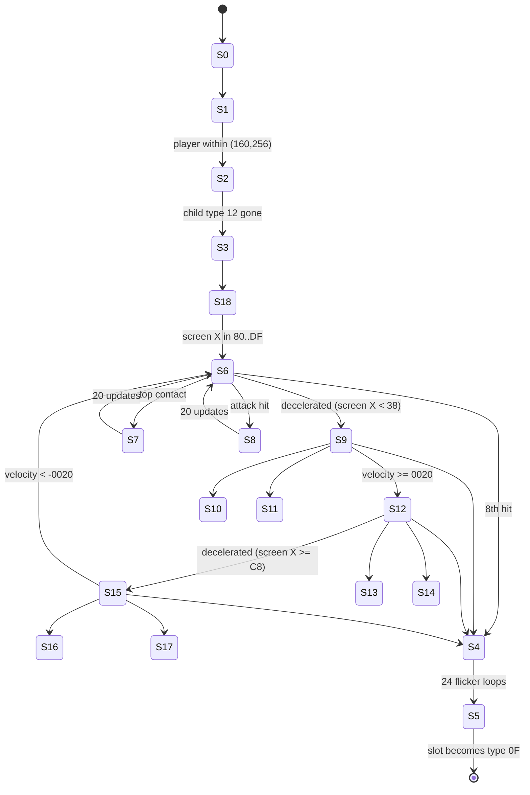

# THZ3 object type `$50` — full study

Research only. ROM: Sonic Chaos (Europe) v1.2, SHA-256
`eabc8db59746714262d2f91a921d054823484349099a9fcd04fd6e84a1fee607` (verified; never committed).
`SonicChaos_POC` was not touched.
Machine-readable facts: `data/rom-cache/thz3/object-50.json` (numeric labels only).
Tool: `tools/object_50.py`. Tests: `tests/test_object_50.py`.
Builds on `docs/thz2-thz3-level-package.md` (placement) and `docs/mapped-object-screen-registration.md` (shared registration).

Evidence classes (same vocabulary as the earlier studies):
**DECODED DATA**, **BYTE-VERIFIED ASSEMBLY** (routine bytes hashed per region and disassembled by hand),
**SOURCE-TRACED BEHAVIOR** (read from the disassembly), **CONTROLLED ROUTINE RESULT** (the original Z80 routines executed on
`z80` with explicit RAM, `tools/oracle.py`), **EMULATED ORIGINAL FRAME** (the complete original game booted in
`tools/sms_frame_harness.py`, forced into THZ act 3, my own label for original code driving an approximate VDP), **UNRESOLVED**.

> **Update (`docs/thz3-boss-support-audit.md`)**: children `$12` (HUD slide-away), `$34` (explosion puff), `$0A` (parameter 0: act-clear bonus `D2A6` + sparkle emitter) and `$0F` (poof, 38 updates)
> are now resolved; the act-clear path is traced through `$1543`; the "181 frames" below is position dependent (186 from X 1760); a hurt Sonic that still has `$D503` bit 1 hits the boss; boss
> arena/camera constants, explicit +-1 contact fixtures and the manifest are in the new study. Sections 10/14 below keep the original wording where not contradicted.

> **Contact/presentation precision:** [thz3-boss-contact-followup.md](thz3-boss-contact-followup.md)
> gives exact flags, palette delay, entry timeline and state-18 cooldown exception.
> The first possible recontact after reaction20 is update21; the earlier22 was
> its attack-driver schedule. Supplement checkpoint is on
> `research/thz3-contact-feedback`, pending review before integration into main.

## 1. Answer

**Type `$50` is the THZ boss. It is one object: arena controller and fighter are the same slot.** The hypothesis is proved from ROM
behavior (nothing below relies on its appearance or on outside notes):

| Behavior found | Evidence |
|---|---|
| 8 hit points (`+$26 = 8`), decremented only by attack contact; 0 starts a dedicated destruction state | CONTROLLED + EMULATED (8 scripted hits) |
| Object start switches the music request from level music `$81` to `$8C`; defeat requests `$97` (clear jingle) | EMULATED + SOURCE-TRACED |
| Locks the camera (left limit raised each update, right limit lowered on trigger) and pans it to a fixed arena (1679/1680, 78) | CONTROLLED + EMULATED |
| Loads act-specific art (selector `$13`) and its own sprite palette `$0C` | CONTROLLED + EMULATED (VRAM identical) |
| Patrols the arena, is solid, hurts a non-attacking player, bounces a player landing on top, flashes on damage | CONTROLLED |
| Defeat: 5 explosion children, flicker, camera release, right limit restored, player state `$20` with clear jingle, type `$0A` child, slot becomes type `$0F` | CONTROLLED + EMULATED |
| Act completes ~181 frames later (`$D293` bit 4 set by the player's state-`$20` handler); next zone (1, 0) loads ~1041 frames after the slot conversion | EMULATED |

`machine-facing label`: keep `object_50` in data. The word *boss* is now justified by the evidence above, but the ROM contains no name string.

There is exactly one placement, so type `$50` appears once in THZ1-3 (THZ3 record 1). Types `$33` and `$40-$4F` point at the same state
table (`$958B`) but are never placed in THZ; only `$50` is studied.

## 2. Placement

**DECODED DATA + BYTE-VERIFIED ASSEMBLY.**

| Field | Value |
|---|---|
| Act | THZ3 (zone index 0, act index 2), object list `0x708FE`, record 1 of 10 |
| ROM offset / bank:CPU | `0x708FE` / `1C:$88FE` |
| Raw bytes | `50 90 08 EE 01 00 00 00 00` |
| Stored X, Y | 2192, 494 (world = stored − 256) |
| World anchor | **(1936, 238)** |
| Flags / parameter / aux0 / aux1 | `$00` / `$00` / `$00` / `$00` |

Creation (controlled run of the original creator `$80EB`): slot `$D700`, `+$00=$50`, state 0, `+$04 = $40` (flags | `$40`),
`+$11/+$14 = 1936/238`, `+$3A/+$3C` saved copies, `+$3F = 0`, `+$08/+$09 = 0`, token `+$3E = 1`, occupancy byte `$D400 = $50`.

Placement loop `$8000`: a record is considered while its occupancy byte is 0. It needs `(x-camX+128)/2` and `(y-camY+128)/2` to fit a
byte, then a cell of the 32×32 spawn-map at bank `$1C:$8146` (cell = 16 px): cell 2 (outer ring) always creates, cells 0/1 create only during
the initial fill (`$D440 == 0`), cell 3 never. Controlled samples: created at camera X 1600 (initial and steady), 1836; not created at 1552, 1553, 1500,
2064, 2065, 2200.

Persistence: the occupancy byte `$D400` stays `$50` after creation. If the boss leaves the visibility window while alive its `+$04` bit 1 is clear (states 6-18
write `+$04` directly), `$61E1` turns the slot into `$FE` and `$5EF8` clears the occupancy byte, so it is re-created from the placement with fresh state.
The defeat path zeroes `+$3E` first, so the byte is never cleared and **it does not respawn in this level session** (CONTROLLED: `$FE` result with bit 1
clear; token 0 and occupancy `$50` after state 5).

## 3. Dispatch

**BYTE-VERIFIED ASSEMBLY + DECODED DATA.** There is no per-type jump table; dispatch is data-driven.

```
placement creator $80EB (bank $1C, ROM $700EB)  -> slot +$00 = $50, state 0
scheduler $5DF1 (fixed bank 0): type in [$26,$F0) -> bank $1E paged
  CALL $64FA   animation engine (state script interpreter, frame record select)
  CALL $5E91   JP (IX+$0C/$0D)   <- the per-state callback = the primary routines
  JP   $61E1   visibility / removal
type table   ROM $065BA + (type-1)*2      entry for $50 at ROM $06658 = $958B
state table  bank $1E:$958B  = ROM $7958B  (19 words; count inferred from the first script at $95B1)
state script bank $1E:$95B1.. (records: duration, frame, callback word; FF-commands)
mapping      ROM $3C000 + type*2 = $3C0A0 -> $94C6 (bank $0F, ROM $3D4C6), 7 frame pointers
```

Primary routines (callbacks) live in bank `$1E`, CPU `$974C..$9A1D`; they use shared engine vectors at `$0320..$03FF`:
`$0329`→`$5EE1` allocator, `$032C`→`$5E9C` allocator (pool `$D540`), `$032F`→`$6065` (RET), `$0338`→`$60FB` (move), `$033B`→`$6328`
(overlap), `$033E`→`$5F54` (destroy/convert), `$034D`→`$5FA0` (overlap + solid), `$0353/$0356/$0359/$035C` camera locks,
`$035F`→`$5F17`, `$0374`→`$1CD3`, `$037D`→`$613C`, `$0383/$0386`→`$61A5/$61B1`, `$03F5`→`$4892`.
Every region has its ROM offset, length, first 16 bytes and SHA-256 in the JSON (`routines`).

State callbacks:

| State | Script (CPU / ROM) | Callback |
|---:|---|---|
| 0 | `$95B1` / `0x795B1` | `$974C` |
| 1 | `$95BA` / `0x795BA` | `$9771` |
| 2 | `$95C0` / `0x795C0` | `$97C1` |
| 3 | `$95C6` / `0x795C6` | `$9828` |
| 4 | `$95CC` / `0x795CC` | `$032F` (idle; script does the work) |
| 5 | `$961E` / `0x7961E` | `$81BD` |
| 6, 12 | `$9632`, `$96C0` | `$985B` |
| 9 | `$9688` | `$9903` |
| 15 | `$9716` | `$9931` |
| 7, 10, 13, 16 | `$9640`, `$9694`, `$96CE`, `$9720` | `$9989` |
| 8, 11, 14, 17 | `$967A`, `$96B6`, `$9708`, `$9742` | `$9997` |
| 18 | `$9624` | `$9A09` |

## 4. Object fields

**SOURCE-TRACED BEHAVIOR.**

| Field | Use |
|---|---|
| `+$00` | type `$50` |
| `+$01` / `+$02` | current / requested state (writing `+$02` changes state) |
| `+$03` | bit 7 set in state 3: overlap runs even when the player's `$D503` bit 6 is set; bit 6 disables overlap |
| `+$04` | bit 1 keep-alive (set in state 0; states 6..18 overwrite it), bit 4 mirror, bit 6 offscreen |
| `+$06` / `+$07` | mapping frame / update timer of the current script record |
| `+$08` / `+$09` | tile base unmirrored (aux0 = 0) / mirrored (state 3 writes `$48`) |
| `+$0B` | saved state while in a reaction state |
| `+$0C/+$0D`, `+$0E/+$0F` | callback, script cursor |
| `+$11/+$12`, `+$14/+$15` | world X, Y (sub-pixel `+$10`, `+$13`) |
| `+$16/+$17`, `+$18/+$19` | 8.8 velocity X, Y (Y is never written by this object) |
| `+$1A`, `+$1C` | screen X, Y from `$3FC8` (anchor − camera) |
| `+$1E` | contact cooldown (2 after a harmful contact) |
| `+$1F` | reaction timer (20) |
| `+$21` | contact bits: 0 player above, 1 below, 2 player right, 3 player left |
| `+$25/+$27` | saved camera right limit (`$D282`) |
| `+$26` | **health** |
| `+$2C/+$2D` | contact extents X/Y, copied from the frame record |
| `+$32` | patrol phase: 0 cruise, `$FF` decelerate, 1 accelerate |
| `+$34/+$35` | pointer to the type-`$12` child |
| `+$38` | frame saved for the defeat flicker |
| `+$3E`, `+$3F` | placement token (1); parameter (0, state 3 writes 1) |

## 5. State machine

**19 states, all reachable statically; every transition below was executed** (CONTROLLED ROUTINE RESULT) and the main path
was executed in the full game (EMULATED ORIGINAL FRAME). Labels are numeric only.



Reaction states return to the state saved in `+$0B` (S7/S8 → S6, S10/S11 → S9, S13/S14 → S12, S16/S17 → S15).

### 5.1 Per-state table

Durations are update counts (one per game frame). "Frames" are mapping frame indices (Section 8).

| State | Entry | Callback action | Movement | Contact | Frames / timing | Exit |
|---:|---|---|---|---|---|---|
| 0 | object created | sound request `$8C` (script `FF 06 8C`); `+$04 \|= $02`; `$D44E = $D297+1`; `$D4A5 = 0`; child type `$12` allocated in pool `$D540` with parameter `$97`; pointer kept in `+$34/+$35`; `$D280 = max($D280, camX)`; `+$25/+$27` = `$D282`; if `$D502 == $12` then `$D502 = $0E` | none | none | 0 (blank) | 1, next update |
| 1 | from 0 | same left-limit/right-limit save every update; trigger test `\|Δx\| < W`, `\|Δy\| < H` with `(W,H)` = `$97A1[$D297+$D4A5]`; zone 0: **W 160, H 256**; on trigger `$D282 = min($D282, camX)` | none | none | 0 | 2 |
| 2 | from 1 | wait while the child's type byte ≠ 0 (~94 frames in the emulated run); then `$D27E = y + dy` and camera pan target `(x + dx, y + dy)` with `(dx,dy)` = `$9808[…]`; zone 0: **(−256, −160)** = target (1680, 78) | none | none | 0 | 3 |
| 3 | from 2 | `$D3B3 = $13` (art), `$D494 \|= $20`, `$D495 = $0C` (palette), `+$09 = $48`, **`+$26 = 8`**, `+$3F = 1`, `+$1E = 0`, `+$32 = 0`, `vx = −$0080`, `+$03 \|= $80` | sets vx | none | 0 | 18 |
| 18 | from 3 | `$0338` move; contact helper `$814D` (solid; non-attacking player: `$D3B0 = $FF`; attacking player: `$8105` knockback); if screen X low byte ∈ `$80..$DF` → state 6 | vx −128/256 | solid, never damages boss | 1,2 (16 updates each) | 6 |
| 6 | from 18, 15, reactions | `$99AE` contact, `$0338`; phases in `+$32` (below) | cruise −128/256 (first sweep) or −130/256 (after a turn) | solid + damage + top bounce + hit | 1,2 (16 each), unmirrored | 9, 7, 8, 4 |
| 9 | 6 decelerated | contact, move; `vx += 2` per update while negative; at `vx ≥ $0020`: `+$32 = 1` | accelerates from ≈0 | as 6 | 5 (8) | 12, 10, 11, 4 |
| 12 | from 9 | as 6 with `+$04 = $10` (mirrored, `+$09` base) | cruise +128/256 | as 6 | 1,2 (16 each), mirrored | 15, 13, 14, 4 |
| 15 | 12 decelerated | contact, move; `vx −= 2` per update while positive; at `vx < −$0020`: `+$32 = 1` | accelerates from ≈0 | as 6 | 5 (8) | 6, 16, 17, 4 |
| 7, 10, 13, 16 | top contact (`$99AE` returns 1) | `+$0B` = state, `+$1F = 20`; move by current velocity; at 0 return to `+$0B` | continues | none | 7: 3,1 / 4,2,… ; 10: 5,6 ; 13 mirrored ; 16: 6,5 | saved state |
| 8, 11, 14, 17 | attack hit (`$99AE` returns `$FF`) | `+$0B` = state, `+$1F = 20`; **no movement**; at 0 return to `+$0B`, `vx = 0`, `+$32 = 1` | frozen | none | 8: 1,2 (4); 11: 5 (8); 14: 1,2 mirrored; 17: 5 (16) | saved state |
| 4 | health reached 0 | script: 5 × `FF 04` type `$34`; saves the current frame in `+$38` (`$9A1E`); 24 × (4 updates saved frame, 2 updates blank frame 0) | none | none | see Section 10 | 5 after 148 updates |
| 5 | from 4 | Section 10 | none | none | 0 | slot → type `$0F` |

Patrol phases (`+$32`) in states 6 and 12 (CONTROLLED, matches EMULATED to ±1 px):

| Phase | Meaning | Rule |
|---|---|---|
| 0 | cruise | 6: when screen X low byte `< $38` → `$FF`. 12: when screen X low byte `≥ $C8` → `$FF` |
| `$FF` | decelerate | 6: `vx += 4`; 12: `vx −= 4`; when `vx + 8` carries (velocity reaches −8/256 in state 6, or goes negative in state 12) request 9 / 15 |
| 1 | accelerate | 6: `vx −= 4`, phase 0 once `vx < −$0080` (hence −130/256); 12: `vx += 4`, phase 0 once `vx ≥ $0080` |

Measured patrol cycle (both CONTROLLED with a fixed camera and EMULATED with the real camera): first sweep S18→S6 ends at x 1900 (screen 221);
left sweep decelerates from x 1734 (screen 55) and stops at x 1726/1727 (screen 47); turn state 9 lasts 19 updates; the right sweep decelerates from
x 1879 (screen 200) to x 1887/1888; turn state 15 lasts 14 updates; **one full 6→9→12→15→6 cycle is 721 updates**. Cruise speed is about 0.5 px/update (−128/256 on the first sweep, −130/256 leftwards after a turn, +128/256 rightwards).

### 5.2 Transition evidence

Every edge of Section 5 with its writer address is in `object-50.json` → `transitions` (each tagged CONTROLLED or SOURCE-TRACED).
Executed fixtures: creation, state 0 init, state-1 boundaries (159/160 and 255/256, both signs), state-2 wait and camera targets, state 3 fields,
state-18 exit boundaries (`$7F/$80`, `$DF/$E0`), the full patrol cycle, the contact matrix in states 6/9/12/15/18, cooldown, health countdown,
all eight reaction states, the state-4 spawn/flicker timeline, state-5 completion with and without floor contact, off-screen removal.

## 6. Movement

**SOURCE-TRACED + CONTROLLED.** `$0338` (`$60FB`) integrates 8.8 velocity into the 16-bit position with sub-pixel bytes `+$10/+$13`.
Only X velocity is used; Y velocity stays 0 (the boss never leaves Y = 238). It is called by states 6, 9, 12, 15, 18 and by the top-bounce reaction states
(7, 10, 13, 16). Hit reaction states (8, 11, 14, 17) do not call it, so the boss freezes for 20 updates.
Arena: camera X 1679 (limits [1600..1680], bottom limit 78), boss anchor X 1726..1888.

## 7. Animation

Script timing is listed in `states[].script` (durations in updates). The engine `$64FA` keeps one timer (`+$07`) per record; a state change reloads
the script. Callbacks run every update regardless of record boundaries. Mirroring is written by `FF 09 04 xx` at the start of states 6..18
(`+$04 = $00` or `$10`); states 12-14 are the only mirrored states.

## 8. Graphics

**Art source: resolved.** Mapping table `bank $0F:$94C6` (ROM `0x3D4C6`), pointer entry `0x3C0A0`; 7 frame pointers
(`$A0E4` shared empty frame, then `$94D4 $94DF $94EA $94F5 $9500 $950B`); all seven frames are reachable.

Dynamic art (**EMULATED: game VRAM tiles `$2E..$AD` are byte-identical to the reconstruction; CONTROLLED: the loader lists**):
state 3 writes selector `$13` to `$D3B3`; loader `$7AC2` indexes the pointer table `$7BA6` (list `$7BD8`) and streams 4 tiles per call:

| # | Bank : CPU (ROM) | Tiles | VRAM | Tile ids | Note |
|---:|---|---:|---|---|---|
| 1 | `$0A:$8940` (`0x28940`) | 72 | `$05C0` | `$2E..$75` | boss art (unmirrored base `+$08 = 0`) |
| 2 | `$0A:$8940` (`0x28940`) | 44 | `$0EC0` | `$76..$A1` | same source through the byte table at ROM `$0100` (bit reversal) = mirrored copy of the first 44 tiles; used with `+$09 = $48` |
| 3 | `$09:$ABA0` (`0x26BA0`) | 12 | `$1440` | `$A2..$AD` | explosion tiles for the type-`$34` children (art base `$A2`), not used by any `$50` frame |

Loading finished at emulated frame 138 (started 106, 32 updates). Frames 5 and 6 need tiles beyond the 44-tile mirrored copy and are only used
unmirrored; frames 1-4 fit both.

Palette: state 3 sets `$D494` bit 5 and `$D495 = $0C`; CRAM 16..31 becomes palette `$0C` (ROM `0x3B70D`), which differs from the THZ sprite palette `$06`
(`0x3B6AD`) only in colours 13-15 (`$0C→$35`, `$08→$20`, `$04→$3F` — level values on the left). The hit flash (queue command 7, bank `$1D:$83C6`,
table `$9979`, zone 0) writes colours 13/14 = `$3F/$3F` for 4 updates, then `$35/$20`.

Frames (all 13 pieces of 8×16, except frame 0 empty; bounds relative to the anchor, unmirrored; mirrored bounds are the X mirror `−x−8`):

| Frame | Pieces | Contact extents `+$2C/+$2D` | Bounds x | Bounds y | Used by states |
|---:|---:|---|---|---|---|
| 0 | 0 | 0/0 | — | — | 0-5 (blank, and the defeat flicker) |
| 1, 2 | 13 | 20/48 | −20..+19 | −48..−1 | 6, 7, 8, 12, 13, 14, 18 (driving frames, alternate) |
| 3, 4 | 13 | 20/48 | −20..+19 | −48..−1 | 7, 13 only (top-contact reaction; rendered art shows the extended top piece) |
| 5, 6 | 13 | 20/48 | −20..+19 | −48..−1 | 9, 10, 11, 15, 16, 17 (front-facing turn), unmirrored only |

Reference PNGs (all frames, unmirrored/mirrored where used, with palette `$0C`) are exported by
`python tools/object_50.py ROM --png build/object-50` (git-ignored, ROM-derived, not committed). The index-pixel hashes are in
`graphics.composed_frame_hashes`. **The game's own sprite attribute table matches the decoded geometry**: at emulated frame 200, frame 2 at
screen (210,160), all 13 expected `(Y, X, tile)` entries are in the game's SAT (`sat_comparison_state_6`).

Registration (shared pipeline, no per-type or GameMaker offset): canonical anchor = `(+$11, +$14)`; `SAT_Y = screen_y + y_origin + piece_y`,
`SAT_X = screen_x + x_origin' + piece_x'`; terrain rows for frames 1-6 are anchor−30 … anchor+17 (the shared +18 term; see the registration study).
Canonical anchor and ROM-visible bounds are stored separately.

## 9. Collision, damage and health

**SOURCE-TRACED + CONTROLLED.** Shared overlap helper `$6328` (vector `$033B`) fills `+$21`:

* horizontal: `|dx| ≤ playerExtX($D52C) + extX(+$2C)`; vertical: player above needs `|dy| ≤ extY(+$2D)`, player at/below needs `dy ≤ playerExtY($D52D)`;
  the axis of least penetration keeps bit pair (0/1) or (2/3). Type `$50` extents: 20 / 48 for every visible frame (0 for frame 0).
  Player extents come from the player's current frame: Sonic is 8/24 in every state except `$0F` (9/24); the fixtures use 8/24 (corrected from an earlier 9/18 assumption, `docs/collision-geometry-audit.md`).
* the helper returns no contact when the object's `+$03` bit 6 is set, or when the player's `$D503` bit 6 is set while the object's `+$03` bit 7 is clear.

Boss contact routine `$99AE` (used by states 6, 9, 12, 15):

| Order | Condition | Result |
|---:|---|---|
| 1 | `+$1E ≠ 0` | `+$1E −= 1`, no contact processing |
| 2 | `$034D`: overlap + **solid push** along the contact axis | `+$21` set |
| 3 | no contact bit | nothing |
| 4 | **bit 0 (player above)** | `$D448 = 0`, player bounce via `$035F`/`$480C` (player state `$0B`, Y velocity `$FC00` = −4.0, sound `$A6`, rolling cleared; ignored if the player already moves up); boss enters **S+1**; **no damage** |
| 5 | player `$D503` bit 1 clear | `$D3B0 = $FF` (shared player damage), `+$1E = 2`; no boss change |
| 6 | player `$D503` bit 1 set (attack) | `$8105` knockback: contact bit 3 → player vx −6.0, bit 2 → +6.0, bit 1 → vy +6.0, bit 0 → vy −4.0, other axis keeps vx and negates vy; player state `$1B`; queue palette command 7; sound `$B6`; **`+$26 −= 1`** |
| 7 | health ≠ 0 | boss enters **S+2** |
| 8 | health = 0 | boss requests **state 4** (no reaction state) |

Results are identical in states 6, 9, 12, 15 (CONTROLLED matrix). State 18 uses the smaller helper `$814D`: solid, damages a non-attacking player,
knocks back an attacking player, never touches health (CONTROLLED).

* **Health**: initial 8 (state 3), decrement 1, 8 hits required, top contact does 0 damage. Invulnerability: the reaction state lasts 20 updates during which no
  overlap routine runs, so hits arrive at most every 22 updates (emulated: frames 201, 223, …, 355). The 2-update cooldown only follows a harmful contact.
* `$D532 == 6` (the power-up tested by other objects) is **not** tested; only `$D503` bit 1.
* Special contact regions: only top vs sides/below (the top is a bounce surface; the art shows an extended top piece in frames 3/4).
* Hit feedback: palette flash (colours 13/14) and sound `$B6`.

## 10. Spawns, defeat and completion

**Children**

| Type | Spawned by | Position | Parameter | Lifetime / purpose |
|---|---|---|---|---|
| `$12` | state 0 (`$81A6`, pool `$D540`) | not positioned | `$97` (the callback's high byte, accidental) | until it removes itself (~94 updates emulated); it decrements 12 SAT Y-buffer bytes `$DB34..$DB3F` and state 2 waits for it. **Purpose UNRESOLVED (follow-up)** |
| `$34` × 5 | state 4 script (`FF 04`, allocator `$5EE1`) | offsets (−8,0), (8,0), (0,−16), (−8,−24), (−8,−24) at updates 1,1,2,3,4 | `$04` | explosion puffs, art base `$A2` in zone 0 |
| `$0A` | state 5 (`$032C`) | pool `$D540` (own script positions it) | `$00` | UNRESOLVED (follow-up); several instances appear during completion |
| `$0F` | `$033E` conversion of the boss slot itself | boss anchor | 0 | defeated-object effect |

There are no projectiles or aimed attacks; the only offense is the body contact of the patrol.

**State 4 (148 updates)**: spawn ×5, blank/saved-frame flicker (24 loops), then request state 5.
**State 5 (`$81BD`)** waits for the player's floor contact (`$D522` bit 1), then: `$D280 = camX`; scroll flags cleared (`$035C`); `$D282` restored from `+$25/+$27`
(2304); player requested state `$20` + sound `$97` (`$89` when `$D298 ≠ 2`) through `$03F5`/`$4892`; child `$0A`; `+$3F = $80`, `+$3E = 0`; `$033E`:
score gate `$5F77` returns for types ≥ `$50` (**no score**; CONTROLLED: `$5F54` on type `$50` changes no score byte, on type `$21` it changes `$D29D`), slot becomes type `$0F` with state, flags, cursor, parameter and token cleared.

**Completion (EMULATED)**: player state `$20` starts the frame after conversion; the player runs right; the state-`$20` handler (bank `$0C:$83A6`) sets `$D293`
bit 4 (bit 5 for acts before act 3) at frame 687 (181 after conversion, player X 2595, camera 2303); the next zone (1, 0) is loaded ~1041 frames after conversion.
The act-clear screens and the next-level load are out of scope.

## 11. Level / boss control summary

| Item | Result |
|---|---|
| Camera bounds | left limit follows the camera until trigger; right limit lowered on trigger; bottom limit 78 and pan target (1680, 78); all restored on defeat |
| Player lock-out | none (the player stays controllable) |
| Boss music | request `$8C` at state 0 (level music `$81` before); `$97` on defeat |
| Level timer | not touched |
| Act complete | indirect, through player state `$20` |
| Goal / end object | none (type `$18` is not spawned); type `$0A` is spawned |
| Terrain mutation | none found |
| Flag `$D44E` | `$D297 + 1` from state 0; bank `$1D` background animations skip while non-zero; never cleared here |

## 12. Evidence summary

| Statement | Class |
|---|---|
| Placement bytes/offset, mapping pointer, state table, scripts | DECODED DATA |
| Routine regions (hash, offset, length) | BYTE-VERIFIED ASSEMBLY |
| Callback behavior (every branch) | SOURCE-TRACED BEHAVIOR |
| Creation, thresholds, patrol, contact matrix, health, reactions, defeat, removal, palette flash | CONTROLLED ROUTINE RESULT |
| Intro timeline, first patrol cycle, 8-hit defeat, VRAM equality, SAT match, completion frames | EMULATED ORIGINAL FRAME |
| "Boss" identity | proved from the combination above |
| Type `$12`/`$0A`/`$34`/`$0F` roles | RESOLVED in `docs/thz3-boss-support-audit.md`; `$D494/$D495` consumer internals still UNRESOLVED |

## 13. POC implementation summary (for a later task, no POC change made)

```
create at (1936,238), state 0, no health yet
S0  music 8C; camera left limit follows camX; spawn helper (waits ~94 updates)
S1  when |dx|<160 and |dy|<256: right limit = camX
S2  when helper gone: pan camera to (x-256, y-160); bottom limit y-160
S3  load art/palette; health = 8; vx = -0.5
S18 enter leftwards until screen X < 224 (hits the player but takes no damage)
loop: S6 left cruise -> (screen X < 56) decelerate 29..32 updates -> S9 turn ->
      S12 right cruise -> (screen X >= 200) decelerate -> S15 turn -> S6
contact (solid): player above -> bounce, S+1 (20 updates, keeps moving);
                 attack from side/below -> knockback, health-1, flash, S+2 (20 updates frozen);
                 otherwise damage the player (2-update cooldown)
health 0 -> S4 (5 explosions, 24 flicker loops, 148 updates) -> S5
S5  when the player is on the floor: release camera, right limit 2304, player victory state + jingle, spawn 0A, convert to 0F, never respawn
```

## 14. Unresolved

* Type `$12` (purpose of its SAT Y-buffer manipulation), `$34`, `$0A`, `$0F` — see follow-ups.
* Consumer of `$D494/$D495` identified only by observed CRAM.
* Player extents while rolling (the attack pose) were not measured; the contact formula is exact, the numbers depend on the player's frame.
* Zones 1-7 rows of the two tables at `$97A1`/`$9808` are decoded as data only.
* Sound names beyond the sound-index class; no Windows/GameMaker run.

Follow-up tasks (not started, to avoid scope growth): object `$12`, object `$34`, object `$0A`, object `$0F`, player state `$20` / act-clear transition.

## 15. Reproduce

```sh
python tools/object_50.py path/to/SonicChaos.sms                    # writes data/rom-cache/thz3/object-50.json (~10 s)
python tools/object_50.py path/to/SonicChaos.sms --check            # byte comparison with the stored cache
python tools/object_50.py path/to/SonicChaos.sms --png build/object-50   # optional local PNGs
python -m unittest tests.test_object_50
python tests/verify_cache.py path/to/SonicChaos.sms                 # includes the regenerated object-50 cache
```
